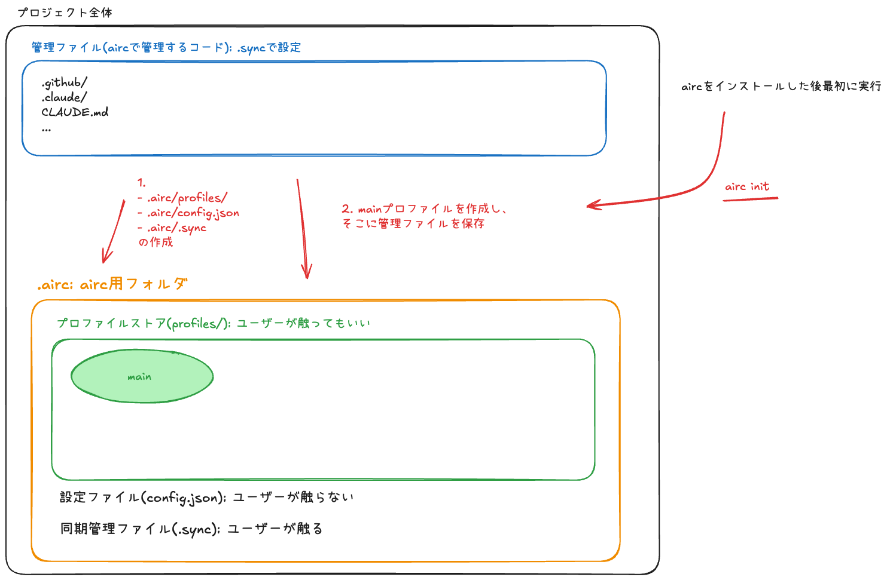
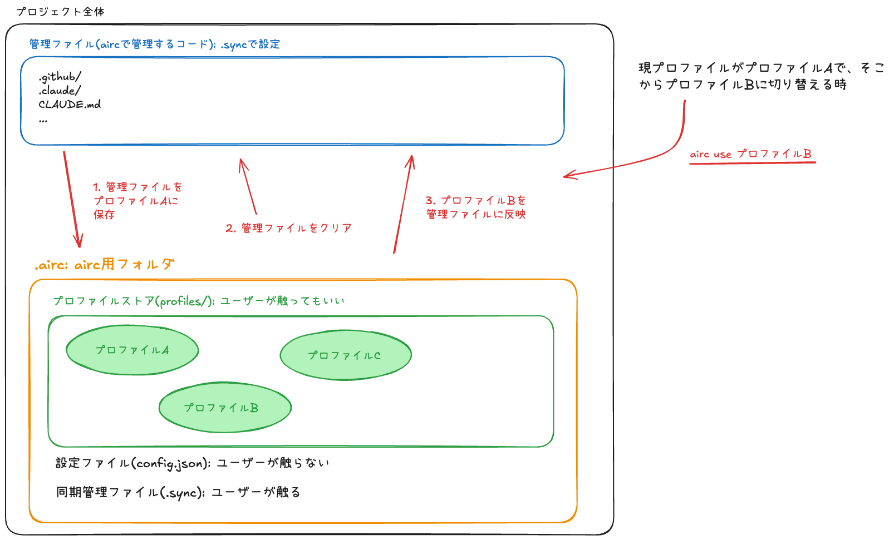
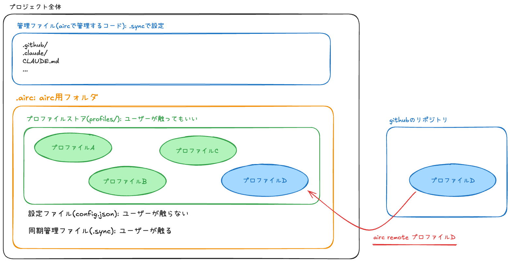

# airc

**airc (AI Resource Configurator)** は、CopilotやClaudeの設定ファイル（`.github/`、`.claude/`、`CLAUDE.md`等）をプロファイル単位で管理・切り替えできるCLIツールです。

## aircについて

aircを使うと、AIツールの設定ファイルを「プロファイル」として保存し、ワンコマンドで切り替えられます。チームで設定を共有したり、用途ごとに設定を使い分けたりできます。

## ユースケース

### 設定を試行錯誤する

新しいClaudeの設定を試しながら、いつでも元に戻せるようにしたいとき：

```bash
airc new experimental    # 実験用プロファイルを作成
# ... 設定を編集して試す ...
airc use default         # 元の設定に戻す
airc use experimental    # また実験設定に切り替え
```

### チームで設定を共有する

チームメンバーと同じClaude設定を使いたいとき：

```bash
airc remote owner my-team
airc remote name team-ai-config
airc remote standard      # チームの標準設定をダウンロード
```

## クイックスタート

```bash
# インストール
npm install -g @maru3460/airc

# 初期化
airc init

# リモートプロファイルをダウンロード
airc remote default
```

## コマンド一覧

| コマンド | 説明 |
|---------|------|
| `airc init` | 初期化 |
| `airc list` | プロファイル一覧 |
| `airc new <name>` | 新規作成 |
| `airc use <name>` | 切り替え |
| `airc rename <old> <new>` | リネーム |
| `airc delete <name>` | 削除 |
| `airc clear` | ファイル削除 |
| `airc restore <name>` | 復元 |
| `airc remote <name>` | リモートからダウンロード |

詳細は [docs/commands.md](docs/commands.md) を参照してください。

## コマンドのイメージ図

### init



### use



### remote



## 要件

- Node.js >= 18.0.0

## ライセンス

MIT
