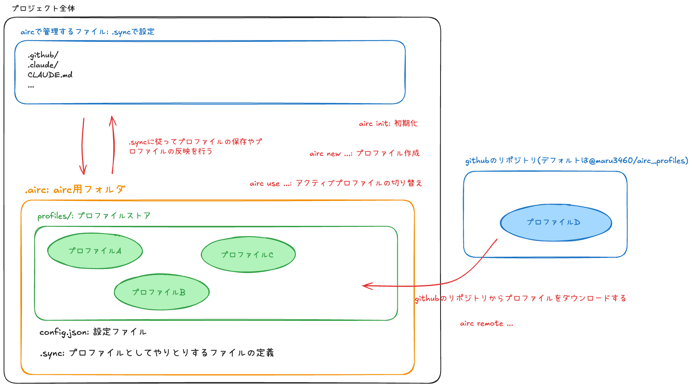

# airc

**airc** は、AIツール設定をプロファイルで管理・切り替えるCLIツールです。

## ⚡ クイックスタート

```bash
npm install -g @maru3460/airc
airc init  # 現在の設定を保存
```

## 🚀 使い方

### プロファイルを作成・切り替え

```bash
airc new experimental  # 新しいプロファイルを作成
airc use experimental  # プロファイルを切り替え
airc use main          # mainに戻す
```

### プロファイル一覧

```bash
airc list  # 保存されているプロファイルを表示
```

### リモートプロファイルの利用

リモートプロファイルストア: [maru3460/airc_profiles](https://github.com/maru3460/airc_profiles)

```bash
airc remote --list  # 利用可能なプロファイルを表示
airc remote sample  # リモートからダウンロード
```

詳細: [docs/concepts.md](docs/concepts.md#リモートプロファイル)

## 📊 イメージ図




## 💡 ユースケース

### 設定を安全に試す

```bash
airc new experimental  # 実験用プロファイルを作成
airc use experimental  # 実験用プロファイルに切り替え
# .claude/ や CLAUDE.md を編集
airc use main          # 元に戻す
```

### チームで設定を統一

```bash
airc remote owner my-team
airc remote name team-config
airc remote standard   # チーム標準設定をダウンロード
airc use standard      # 標準設定に切り替え
```

## 📖 CLI Options

### 基本コマンド

| コマンド | 説明 |
|---------|------|
| `airc init` | 現在の設定をmainプロファイルとして保存 |
| `airc list` | プロファイル一覧を表示 |
| `airc new <name>` | 新しいプロファイルを作成 |
| `airc use <name>` | プロファイルを切り替え |

### 管理コマンド

| コマンド | 説明 |
|---------|------|
| `airc rename <old> <new>` | プロファイル名を変更 |
| `airc delete <name>` | プロファイルを削除 |
| `airc clear` | 現在のファイルを削除（プロファイルは保持） |
| `airc restore <name>` | プロファイルから展開 |

### リモート連携

| コマンド | 説明 |
|---------|------|
| `airc remote owner <owner>` | GitHubリポジトリオーナーを設定 |
| `airc remote name <repo>` | リポジトリ名を設定 |
| `airc remote branch <branch>` | ブランチを設定 |
| `airc remote token [token]` | トークンを取得または設定（プライベートリポジトリ用） |
| `airc remote <profile>` | リモートからプロファイルをダウンロード |

詳細: [docs/commands.md](docs/commands.md)

## ⚙️ 設定

### .sync ファイル

`.airc/.sync` でプロファイルと同期するファイルをglobパターンで定義できます。

```bash
# ディレクトリ全体を同期
.github/
.claude/

# 特定ファイルを同期
CLAUDE.md

# 除外パターン
!*.log
```

詳細: [docs/configuration.md](docs/configuration.md)

## 🔧 トラブルシューティング

問題が発生した場合は、[FAQ](docs/faq.md)を参照してください。

## 📄 License

MIT
